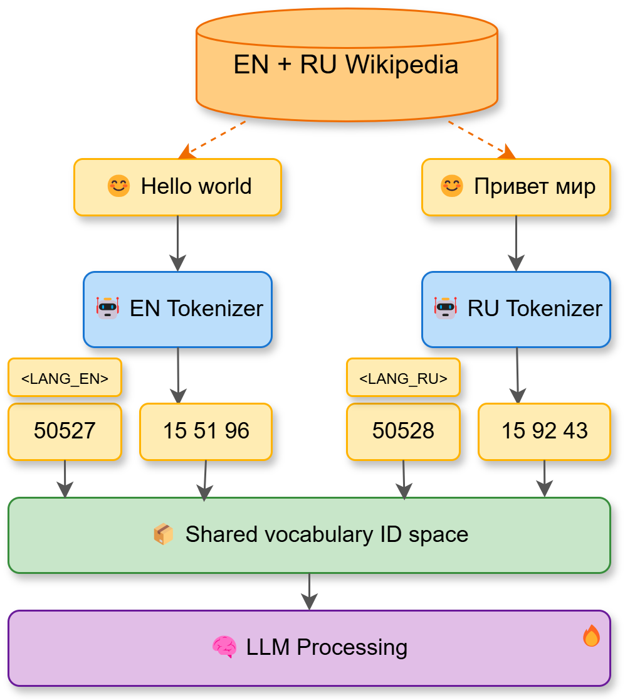
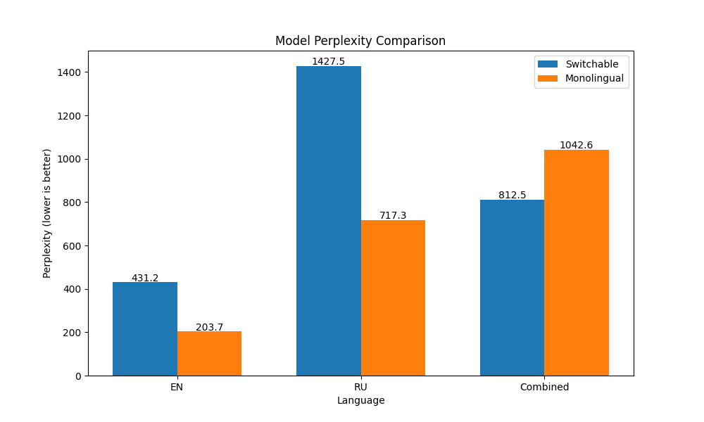
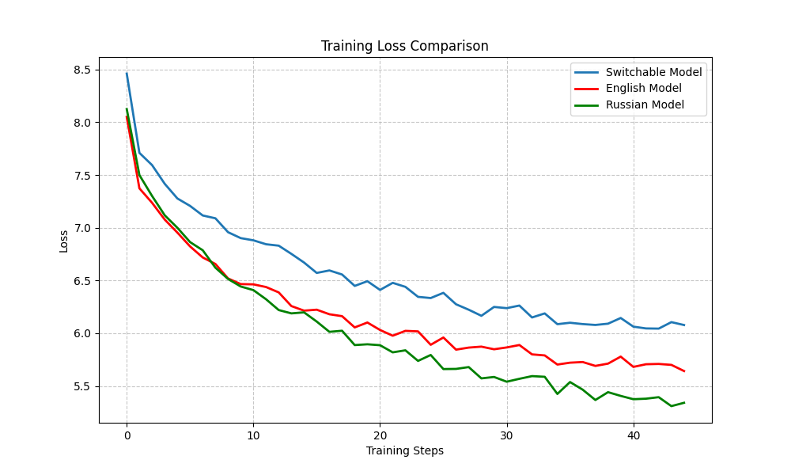

# Switch-Tokenizer

A multilingual tokenizer implementation that uses a shared vocabulary space between different language-specific tokenizers, enabling efficient parameter usage in multilingual language models through context-dependent token interpretation.

## Key Concept: The Switch-Tokenizer Approach

Traditional multilingual models concatenate vocabularies from different languages, resulting in very large vocabulary sizes that significantly increase parameter costs in both the token embedding layer and the output language modeling head.

The Switch-Tokenizer takes a fundamentally different approach:
- Each language has its own tokenizer with its own vocabulary
- All tokenizers map into the **same shared vocabulary ID space**
- Special language tokens (`<LANG_EN>`, `<LANG_RU>`, etc.) provide context about which tokenizer's "interpretation" to use
- The model learns to associate token IDs with different tokens depending on the language context

This approach maintains a fixed-size embedding table and output projection layer regardless of the number of languages, achieving significant parameter efficiency for multilingual models.



*Figure 1: Diagram illustrating how Switch-Tokenizer maps tokens from different languages into a shared vocabulary space while maintaining language context through special language tokens.*

## Implementation Challenges

The main challenges in this approach include:

1. **Learning Context-Dependence**: The model needs to learn to maintain language context throughout a sequence
2. **Same ID, Different Meanings**: Each embedding vector represents different tokens in different languages
3. **Tokenization Efficiency**: Without explicit vocabulary merging, repeated tokens across languages don't get automatically shared

## Experiments and Results

The Switch-Tokenizer framework includes four planned experiments to thoroughly evaluate its effectiveness:

All experiments are implemented in the [switch_tokenizer_experiments.ipynb](switch_tokenizer_experiments.ipynb) notebook, which provides detailed code and explanation for running each experiment.

### Experiment 1: Initial Feasibility and Performance (Completed)

We trained models from scratch using gpt2-medium as the base architecture for 2.5M tokens on English and Russian datasets:
- Data source: Wikipedia articles (wikimedia/wikipedia dataset, 2023-11-01 dumps)
- English tokenizer: gpt2
- Russian tokenizer: ai-forever/ruGPT-3.5-13B

**Key Findings:**
- The switchable model significantly outperforms monolingual models on combined multilingual tasks
- For single-language tasks, specialized monolingual models perform better as expected
- Tokenization efficiency remains consistent between switchable and monolingual approaches

For more details and models, visit the [Hugging Face repository](https://huggingface.co/hardesttype/switch-tokenizer-exp-1).


*Figure 2: Comparison of perplexity between Switchable and Monolingual models.*


*Figure 3: Performance comparison showing training losses for the Switch-Tokenizer approach.*

### Experiment 2: Comparison vs. Concatenated Vocab (Planned)

This experiment will compare the switchable tokenizer approach with a model using a concatenated vocabulary:
- Performance comparison of switchable tokenizer vs. large concatenated vocabulary
- Analysis of parameter efficiency between the two approaches
- Evaluation of training and inference speed differences

### Experiment 3: Multilingual Baseline (Planned)

This experiment will compare the Switch-Tokenizer against a standard multilingual tokenizer:
- Tokenization efficiency comparison
- Performance evaluation on cross-lingual tasks
- Vocabulary utilization analysis
- Training dynamics comparison

### Experiment 4: Context Sensitivity Analysis (Planned)

This experiment will analyze how token probabilities shift based on language context:
- Examination of how the model learns to interpret token IDs differently based on context
- Analysis of token embedding spaces for different languages
- Visualization of language-specific probability distributions
- Evaluation of context-switching capabilities

## Future Work

### Dynamic Tokenizer Switching

We plan to develop models that can dynamically predict which tokenizer to use based on context:
- Automatic language detection without explicit language tokens
- Real-time tokenizer selection during inference
- Self-supervised tokenizer selection during training

### Scaling to Larger Models

Future work will focus on applying the Switch-Tokenizer approach to larger models:
- Training larger models with expanded parameter counts
- Exploring efficiency gains at scale
- Analyzing the relationship between model size and multilingual capabilities

### Specialized Tokenizers for Code

We plan to extend the Switch-Tokenizer approach to programming languages:
- Integration of specialized code tokenizers
- Context-dependent interpretation of code constructs
- Multi-programming-language support in a single model

### Expanded Benchmarks and Evaluation

Future work will include more comprehensive benchmarking of the Switch-Tokenizer approach:
- Evaluation on standard multilingual benchmarks (XNLI, XQuAD, PAWS-X)
- Performance assessment on machine translation tasks
- Evaluation of few-shot learning across languages
- Comparison with state-of-the-art multilingual models
- Analysis of computational efficiency and memory usage at scale

## Installation

```bash
git clone https://github.com/hardesttype/switch-tokenizer.git
cd switch-tokenizer
pip install -r requirements.txt
```

## Technical Implementation

The implementation consists of several key components:

### 1. SwitchableTokenizer

The core class that manages the shared vocabulary space:

- Initializes with separate tokenizers for each language
- Maps token IDs from each tokenizer into the same shared space
- Uses special tokens like `<LANG_EN>` and `<LANG_RU>` to provide language context
- Handles encoding, decoding, and language switching

### 2. Model Integration

The model is configured to work with the shared vocabulary space:

- The embedding table and output projection layer have a fixed vocabulary size (plus special tokens)
- The model learns context-dependent interpretation of token IDs based on preceding language tokens
- This context-dependence is learned purely from data, without hard-coded mappings

### 3. Training Infrastructure

The implementation includes:

- Dataset preparation with language-specific contexts
- Switchable data collator for handling multilingual batches
- Training utilities with the Trainer API
- Evaluation utilities to measure perplexity and token distribution

## Usage Examples

### Basic Tokenization

```python
from src.switch_tokenizer import SwitchableTokenizer

tokenizer = SwitchableTokenizer(
    en_tokenizer_path="gpt2",
    ru_tokenizer_path="ai-forever/ruGPT-3.5-13B",
)

# Tokenize English text
en_tokens = tokenizer.encode("Hello world", language="EN")
print(f"English: {tokenizer.decode(en_tokens)}")

# Tokenize Russian text
ru_tokens = tokenizer.encode("Привет мир", language="RU")
print(f"Russian: {tokenizer.decode(ru_tokens)}")
```

### Training a Model

```python
from src.model_utils import create_model_with_switchable_tokenizer
from src.data_utils import prepare_multilingual_datasets, SwitchableDataCollator
from transformers import Trainer, TrainingArguments

# Initialize tokenizer and datasets
tokenizer = SwitchableTokenizer(...)
datasets = prepare_multilingual_datasets(tokenizer, ...)

# Create model with the shared vocabulary
model = create_model_with_switchable_tokenizer(
    model_name_or_path="gpt2",
    tokenizer=tokenizer,
)

# Train the model
trainer = Trainer(
    model=model,
    args=training_args,
    data_collator=SwitchableDataCollator(tokenizer),
    train_dataset=datasets["train"],
    eval_dataset=datasets["test"],
)

trainer.train()
```

### Text Generation

```python
from src.model_utils import generate_text

# Generate text in a specific language
en_text = generate_text(
    model=model,
    tokenizer=tokenizer,
    prompt="The weather today is",
    language="EN",
    max_new_tokens=50,
)

# Generate text in another language
ru_text = generate_text(
    model=model,
    tokenizer=tokenizer,
    prompt="Погода сегодня",
    language="RU",
    max_new_tokens=50,
)
```

## Reference Papers

1. "Zero-Shot Tokenizer Transfer" (Minixhofer et al., 2024)
2. "LazyLLM: Dynamic Token Pruning for Efficient Long Context LLM Inference" (Fu et al., 2024)
3. "ReTok: Replacing Tokenizer to Enhance Representation Efficiency in Large Language Model" (Gu et al., 2024)
4. "MrT5: Dynamic Token Merging for Efficient Byte-level Language Models" (Kallini et al., 2024)
5. "Retrofitting Large Language Models with Dynamic Tokenization" (Feher et al., 2024)
6. "Language Models are Unsupervised Multitask Learners" (Radford et al., 2019)
7. "A Family of Pretrained Transformer Language Models for Russian" (Zmitrovich et al., 2023)
8. "How does a Language-Specific Tokenizer affect LLMs?" (Seo et al., 2024)
9. "Qtok: A Comprehensive Framework for Evaluating Multilingual Tokenizer Quality in Large Language Models" (Chelombitko et al., 2023)
10. "Getting the most out of your tokenizer for pre-training and domain adaptation" (Dagan et al., 2023)
11. "Tokenizer Choice For LLM Training: Negligible or Crucial?" (Ali et al., 2024)

## Further Examples

For detailed examples, check the [examples.md](examples.md) file.

## License

This project is licensed under the MIT License - see the LICENSE file for details. 